# 🐾 Virtual Pet Simulator

## Overview
The **Virtual Pet Simulator** is a Python program with a **Tkinter GUI** and **OpenAI integration**. Users can create a pet and interact with it through playing, feeding, resting, cleaning, training, chores, visiting the vet, reactions, and time simulation. The program tracks **care level**, **tiredness**, **funds**, and pet lifespan, with AI-based input validation for strict action enforcement.

This project demonstrates:
- GUI development with `Tkinter`
- Object-oriented programming (OOP)
- AI integration via `OpenAI` API
- Input validation and error handling
- Logical processing and time simulation

---

## Project Files

### `Pet.py`
**Purpose:** Logical representation of a pet.  

**Class: `Pet`**  

**Attributes:**  
- `name`, `species`, `color`, `age` – basic information  
- `care_level`, `tired_level` – numeric stats  
- `funds` – money earned from chores  
- `_cost` – total money spent  
- `_in_debt` – indicates if the pet is in debt  
- `_alive` – pet life status  
- `on_death` – callback for pet death  

**Methods:**
- `__init__(name, species, color, age, output_func, input_func)` – initializes pet  
- `get_input(prompt)` – gets validated user input (via GUI)  
- `spend(amount)` – reduces funds  
- `earn(amount)` – increases funds  
- `ai_text(prompt)` – sends prompt to OpenAI for text generation  
- `act_play(choice=None, custom_input=False, simulate=False)` – play with pet  
- `act_rest(choice=None, custom_input=False, cost=0, simulate=False)` – rest action  
- `act_feed(choice=None, cost=5, custom_input=False, simulate=False)` – feed the pet  
- `act_train(choice=None, custom_input=False)` – train the pet  
- `act_clean(choice=None, custom_input=False)` – clean the pet  
- `act_chore(choice=None, earned=10, custom_input=False)` – perform chore  
- `act_vet(choice=None, custom_input=False)` – visit vet  
- `get_reaction()` – returns descriptive mood text  
- `health_check()` – outputs pet’s stats  
- `check_life_status()` – checks if pet is alive  
- `die(reason)` – handles pet death  
- `final_summary()` – prints final summary of pet stats and activities  
- `simulate(duration)` – fast-forwards the pet’s life by a specified duration  

---

### `Virtual_Pet.py`
**Purpose:** GUI and user interaction.  

**Class: `Virtual_Pet`**  

**Attributes:**  
- `root` – main Tkinter window  
- `pet` – instance of `Pet`  
- `color` – selected pet color  
- `current_hour`, `current_minute`, `current_day`, `current_month`, `current_year` – in-game time  
- `care_var`, `tired_var` – progress bars for stats  

**GUI Helper Methods:**
- `check_species_other(value)` – shows/hides custom species entry  
- `pick_color(event)` – opens color chooser for pet color  
- `app_output(text)` – display message in GUI console with timestamp  
- `gui_input(prompt)` – prompt user for input via dialog  
- `increment_time(hours=0, minutes=0)` – advances in-game time correctly  
- `update_status_bars()` – updates GUI bars and mood emoji  
- `update_funds_label()` – updates funds display  
- `get_mood_emoji()` – returns mood emoji based on pet stats  
- `handle_pet_death()` – handles GUI for when pet dies  
- `show_tutorial()` – opens Help/Tutorial window  
- `ai_validate_species(species)` – validates species with OpenAI  
- `ai_max_age(species)` – estimates max age of custom species via AI  
- `ai_validate_action(action, context, species=None)` – strictly validates user actions with GPT-4  

**Pet Action Methods:**
- `create_pet()` – validates input and creates a pet  
- `play()` – prompts user for play action, validated by AI  
- `rest()` – prompts user for rest action, validated by AI  
- `feed()` – prompts user for feeding action, validated by AI  
- `clean()` – prompts user for cleaning action, validated by AI  
- `train()` – prompts user for training action, validated by AI  
- `do_chore()` – prompts user for chore, validated by AI  
- `health_check()` – shows pet stats  
- `visit_vet()` – prompts user for vet action, validated by AI  
- `reaction()` – shows pet reaction/mood  
- `simulate()` – prompts user for duration and fast-forwards time  

**Notes:**  
All user inputs for actions are validated **strictly via OpenAI GPT-4** to ensure only real or sensible actions are accepted. Invalid actions will prompt the user repeatedly until a valid input is given.

---



```mermaid
classDiagram
    class Pet {
        - _name: str
        - _species: str
        - _color: str
        - _age: int
        - _care_level: int
        - _tired_level: int
        - _funds: float
        - _cost: float
        - _in_debt: bool
        - _alive: bool
        - output: func
        - input_func: func
        - on_death: func
        + __init__(...)
        + get_input(prompt)
        + spend(amount)
        + earn(amount)
        + ai_text(prompt)
        + act_play(choice)
        + act_rest(choice)
        + act_feed(choice)
        + act_train(choice)
        + act_clean(choice)
        + act_chore(choice)
        + act_vet(choice)
        + get_reaction()
        + health_check()
        + check_life_status()
        + die(reason)
        + final_summary()
        + simulate(duration)
    }

    class Virtual_Pet {
        - root: Tk
        - pet: Pet
        - color: str
        - current_hour: int
        - current_minute: int
        - current_day: int
        - current_month: int
        - current_year: int
        - care_var: DoubleVar
        - tired_var: DoubleVar
        + __init__(root)
        + check_species_other(v)
        + pick_color(event)
        + app_output(text)
        + gui_input(prompt)
        + increment_time(h,m)
        + create_pet()
        + ai_validate_species(s)
        + ai_max_age(s)
        + ai_validate_action(a,c,s)
        + update_status_bars()
        + update_funds_label()
        + get_mood_emoji()
        + handle_pet_death()
        + show_tutorial()
        + play()
        + rest()
        + feed()
        + clean()
        + train()
        + do_chore()
        + health_check()
        + visit_vet()
        + reaction()
        + simulate()
    }

    Virtual_Pet --> Pet
```

## Technical Summary

| Feature | Description |
|----------|-------------|
| Language | Python 3.x |
| Libraries | `tkinter`, `tkinter.ttk`, `openai`, `random`, `colorchooser`, `tkinter.messagebox`, `tkinter.simpledialog` |
| Concepts | OOP, AI Integration, GUI Design, Input Validation, Time Simulation, Event-Driven Programming |
| Interface | Graphical User Interface (GUI) |
| AI | GPT-4 API used for validating species and user actions |

---

## How to Run

1. Install Python 3.x (preferably 3.12 or higher)  
2. Install dependencies:  
   ```bash
   pip install openai
   ```
3. Run the GUI:
   ```bash
   python Virtual_Pet.py
   ```
4. Fill in pet details, click Create Pet, then interact using the left-side buttons.

## FBLA Documentation Summary

| Stage      | Description                                                                                                          |
| ---------- | -------------------------------------------------------------------------------------------------------------------- |
| Planning   | Designed pet simulator with GUI and AI input validation.                                                             |
| Design     | Modularized logic (`Pet.py`) and GUI (`Virtual_Pet.py`).                                                           |
| Coding     | Implemented OOP, AI validation, and event-driven GUI.                                                                |
| Testing    | Verified all inputs, AI validation, random and custom actions, GUI updates, time simulation, and pet death handling. |
| Evaluation | Fully meets FBLA Introduction to Programming requirements: input, processing, output, GUI, and AI validation.        |

## Credits / Acknowledgements
Created by: Rithvik Penmetsa

Python Libraries: `tkinter`, `tkinter.ttk`, `openai`, `random`, `colorchooser`, `tkinter.messagebox`, `tkinter.simpledialog`

AI Integration: OpenAI GPT-4

FBLA Introduction to Programming - 2025

References:
- FBLA Guidelines PDF
- Python Tkinter Documentation
- OpenAI API Documentation

---

## Additional Documentation
### Comprehensive Documentation Includes:
- README file
- Source code (`Pet.py` and `Virtual_Pet.py`)
- Documentation for libraries used
- Attribution for any open-source or copyrighted material